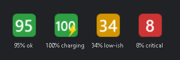

# vxe-battery-tray

[](https://github.com/ivancacic/vxe-battery-tray/actions/workflows/ci.yml)
[](LICENSE)

A tiny **Windows system-tray battery monitor** for the **ATK GEAR / VXE R1 SE+** wireless gaming mouse.

It talks to the mouse's wireless receiver directly over raw HID and shows the battery level as a colour-coded number in your notification tray — **no vendor software, no drivers, no installers, and no admin rights required.**



---

## Why?

Windows doesn't surface a battery reading for this mouse, because the receiver presents itself as a *vendor-defined* HID device rather than a standard HID battery. This tool speaks the mouse's own vendor protocol (reverse-engineered — see [PROTOCOL.md](PROTOCOL.md)) to pull the real value straight from the dongle.

## Features

- **Live tray icon** — bold percentage on a colour-coded pill: green ≥ 50%, amber ≥ 20%, red below. A ⚡ bolt appears while charging.
- **Hover tooltip** — e.g. `VXE R1 SE+: 95% on battery 4.10 V` (includes cell voltage).
- **Low-battery toast** — a Windows notification when you drop to your threshold while unplugged. Fires once, then re-arms after recovery.
- **Configurable** — right-click → *Settings…* to set the poll interval and the low-battery threshold. Saved to `%AppData%\VxeBatteryTray\settings.ini`.
- **Survives sleep** — reconnects automatically after resume, unlock, or replugging the receiver, instead of getting stuck on a stale reading.
- **Start with Windows** — one-click toggle (a per-user registry `Run` entry).
- **Light footprint** — ~33 MB RAM, single instance, no background CPU between polls.
- **Zero dependencies** — a single ~15 KB `.exe` built with the .NET Framework compiler that already ships with Windows.

## Requirements

- Windows 10 or 11 (x64).
- An ATK GEAR / VXE **R1 SE+** with its 2.4 GHz USB receiver plugged in.
  - The receiver enumerates as USB `VID_373B` / `PID_1085` ("Wireless mouse -1k dongle").
  - Other VXE models may use a different command byte — see [PROTOCOL.md](PROTOCOL.md).
- No .NET SDK needed. The in-box .NET Framework 4.x compiler (`csc.exe`, present on every modern Windows) is used to build.

## Download

Grab `VxeBatteryTray.exe` from the [latest release](https://github.com/ivancacic/vxe-battery-tray/releases/latest) and run it — there's no installer.

> Windows SmartScreen may warn on first run because the executable isn't code-signed. Choose **More info → Run anyway**, or build it yourself from source below. Each release ships a `SHA256SUMS.txt` you can check against:
>
> ```powershell
> Get-FileHash .\VxeBatteryTray.exe -Algorithm SHA256
> ```

## Build

```powershell
powershell -ExecutionPolicy Bypass -File .\build.ps1
```

This generates `app.ico` (if missing) and compiles `VxeBatteryTray.exe` into the repo folder. That's it.

Releases are built the same way on a clean Windows runner — see [`.github/workflows`](.github/workflows).

## Run

Double-click `VxeBatteryTray.exe`, or:

```powershell
Start-Process .\VxeBatteryTray.exe
```

The icon appears in the tray (click the `^` overflow arrow if hidden — you can drag it onto the taskbar to keep it visible). Right-click for the menu; double-click to refresh immediately.

To launch automatically at login, right-click the tray icon → **Start with Windows**.

## Command-line version

Prefer a quick reading in a terminal? [`vxe-battery.ps1`](vxe-battery.ps1) prints the battery once, or polls with `-Watch`:

```powershell
powershell -ExecutionPolicy Bypass -File .\vxe-battery.ps1
powershell -ExecutionPolicy Bypass -File .\vxe-battery.ps1 -Watch -IntervalSec 30
```

```
VXE R1 SE+ battery monitor (POC)
[20:57:10] VXE R1 SE+  [###################-]  95%  on battery  4.10 V
```

## Does polling drain the battery?

No, not measurably. Each poll is a single tiny radio exchange — negligible next to the 1000 Hz motion reporting the mouse already does when awake, and the receiver typically answers from a cached value. The poll interval is really a "how fresh do I want the number" knob, not a battery-life trade-off. The default of 5 minutes is plenty; battery percentage changes over hours.

## Troubleshooting

| Symptom | Likely cause / fix |
| --- | --- |
| Tray shows a grey **?** | No reading yet this session — receiver unplugged or mouse powered off. Hover for the reason. |
| Number goes **grey** | The last known value, shown while the link is down (e.g. just after waking). It retries automatically and returns to colour once it reconnects. |
| "No reply — mouse may be asleep" | Give the mouse a wiggle and right-click → *Refresh now*. |
| Wrong / stuck value on a different VXE model | The battery command byte may differ. See [PROTOCOL.md](PROTOCOL.md) and try command `0x17`. |
| Toast never appears | Check Windows **Focus Assist / Do Not Disturb**; it may route the alert straight to the Action Center. |

## Files

| File | Purpose |
| --- | --- |
| `Program.cs` | The tray app (C#, WinForms). |
| `build.ps1` | Compiles the exe with the in-box .NET Framework compiler. |
| `make-icon.ps1` | Generates the embedded `app.ico`. |
| `vxe-battery.ps1` | Standalone command-line reader. |
| `PROTOCOL.md` | The reverse-engineered HID battery protocol. |

## Credits

The HID battery protocol was worked out with reference to two excellent Linux projects:

- [BuSd777/OpenVXE](https://github.com/BuSd777/OpenVXE)
- [svetikas/battery](https://github.com/svetikas/battery)

This project is an independent Windows implementation. Thanks to both for documenting the protocol.

## Disclaimer

Unofficial and not affiliated with, endorsed by, or supported by VXE or ATK GEAR. It communicates with the device using its own HID interface and does not modify firmware or settings. Use at your own risk.

## License

[MIT](LICENSE) © 2026 vxe-battery-tray contributors
